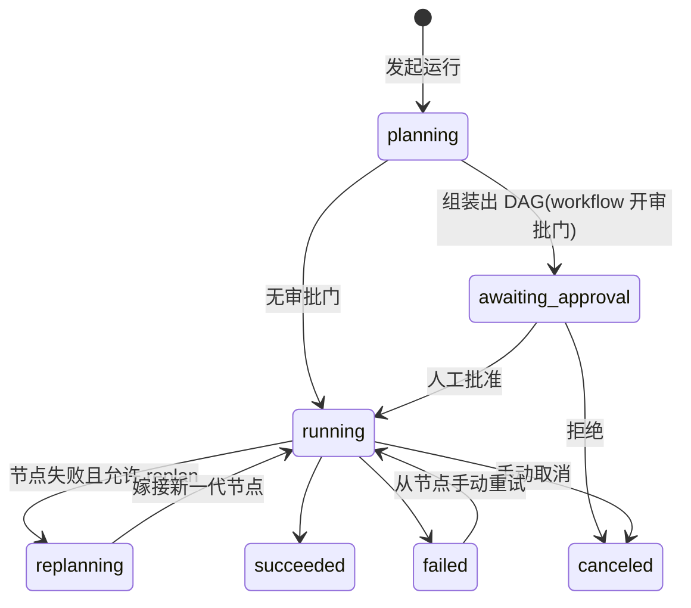

# loom — Agent Workflow Orchestrator

可编排、可控制、可观测的 agent 工作流系统,**双模式**:

- **static**(plan-then-execute):planner 一次性组装 DAG → 审批 → 确定性引擎执行。终止由无环结构保证。
- **dynamic**(coordinator + A2A):一个 coordinator agent 运行时逐步分解、委派、跟进、收敛,任务树**涌现**而非预先声明。终止由预算硬限保证。

两种模式共用同一个 agent 池、交换目录、UI 与执行层。**执行层走 ACP(Agent Client Protocol)**:每个 agent 是一个独立的 ACP 会话,拥有自己的 AGENTS.md、自己的持久 workspace 和自己的私有 skills。dynamic 模式下 agent 之间的委派/回报/反问走 **MCP 工具 → loom hub → A2A 任务台账**,全程可审计。

Go 单二进制,内嵌 Web UI,文件存储。三个第三方 Go 依赖,全部是协议层:
[coder/acp-go-sdk](https://github.com/coder/acp-go-sdk)(ACP)、
[a2aproject/a2a-go](https://github.com/a2aproject/a2a-go)(A2A)、
[modelcontextprotocol/go-sdk](https://github.com/modelcontextprotocol/go-sdk)(MCP)。

## 快速开始

```bash
cd loom
npm install --prefix .acp @zed-industries/claude-code-acp   # ACP 适配器(一次性)
go run ./cmd/loom                  # 默认 :7333
go run ./cmd/loom -dry-run         # 零成本演示模式(UI 里 dry-run 开关默认打开)
```

已安装(`./scripts/install.sh`)后,进程管理内建在二进制里:

```bash
loom start      # 后台启动(日志: <data>/loom.log)
loom restart    # 改完代码重编译后,一条命令换新进程
loom stop       # 优雅停止(SIGTERM;中断的 dynamic run 下次启动可恢复)
loom status     # 在跑吗?pid / 地址 / 数据目录
```

打开 http://localhost:7333。首次启动自动写入 5 个种子 agent 和 4 个示例 workflow(3 个 static + 1 个 dynamic)。
种子池保证任意两个 agent 的(模型, 工具白名单)有实质差异——只差 prompt 的名义拆分会被合并(实现与自测就是同一个 agent)。

零成本体验 static:选「功能开发」→ 发起运行 → 勾选「演示模式(dry run)」→ 观察 DAG 组装 → 批准执行 → 看并行节点实时推进。goal 里包含 `simulate-fail` 可触发失败 → 自动 replan → 恢复。

零成本体验 dynamic:选「动态编排」→ 发起运行 → 勾选「演示模式」→ coordinator 提交首批计划 → 批准 → 看任务树实时涌现。goal 里的标记词决定演示哪条路径:

| 标记 | 演示 |
|---|---|
| `simulate-ask` | worker 反问 → 任务转 `input-required` → coordinator 答复 → 继续 |
| `simulate-handoff` | worker 直接把子任务交接给同伴(需开 peer handoff) |
| `simulate-budget` | coordinator 一直委派直到预算拒绝,然后收敛而非死循环 |
| `simulate-fail` | worker 返回错误信封(带 `failure_kind`),coordinator 判定失败 |
| `simulate-reject` | worker **谎报完成**但没交产物 → 引擎执行验收契约把任务判 failed——自述不作数 |

dry-run 在 dynamic 模式下是**一个真实的 MCP 客户端**——它连的是 agent 连的同一个 hub 端点,调的是同一套工具,只有"判断"是脚本化的。所以零成本演示真的穿过了 MCP 传输、token 鉴权、策略引擎和台账。

## 三个核心实体

| 实体 | 是什么 | 存储 |
|---|---|---|
| **Agent** | 共享池中可复用的 executor:定义 + 独立 home(AGENTS.md、私有 workspace、私有 skills) | `data/agents/<name>/`(见下) |
| **Workflow** | 独立的 orchestrator:`mode` + 该模式的配置(static:planner/审批门/replan;dynamic:coordinator/预算护栏)+ 池子集 | `data/workflows/<id>.json` |
| **Run** | 一次执行:static 是 DAG 计划 + 节点状态;dynamic 是任务台账(每个任务带 A2A 生命周期与完整消息往来)。两者共用追加式事件审计日志 | `data/runs/<id>/run.json` |

### Agent home:每个 agent 的独立环境

```
data/agents/<name>/
  agent.md               定义(frontmatter:model/tools/max_turns + 正文 = system prompt)
  home/                  该 agent 的私有 workspace(ACP 会话的 cwd,跨 run 持久)
    AGENTS.md            保存定义时自动生成:角色 prompt + loom 执行契约
    .claude/skills/      该 agent 的私有 skills(SKILL.md,会话自动加载)
```

节点执行时 ACP 会话在 agent 自己的 home 中启动——AGENTS.md 和私有 skills 被运行时原生加载(实测:agent 会在任务中显式调用自己的 skill)。工具白名单**双重强制**:除了应答权限请求,loom 在每次开会话前把白名单编译成 Claude Code 原生 `permissions.deny` 规则写入会话 cwd 的 `.claude/settings.local.json`(loom 托管,勿手改)——只读工具与 Task 默认不发权限请求,deny 规则是对它们唯一有效的机制层拦截;coordinator 白名单为空,因此除 hub 工具外一切被禁,派活是它唯一能做的事。跨节点协作走 run 的**交换目录** `data/runs/<id>/workspace/`:节点 prompt 中给出其绝对路径,上游产物在此,交付物必须写到此;agent 自己的 home 用于草稿和跨 run 积累。skills 可在 UI 的 agent 编辑器中直接增删改。

## 运行生命周期(static)



关键机制:

- **Planner 校验**:planner 输出 JSON DAG 后做静态检查(无环、id 唯一、agent 必须在池中、节点数上限);不合格自动带错误反馈重试一次。
- **Planner 自建 agent**(workflow 开关 `allow_agent_creation`):池中缺少所需专家时,planner 可在计划的 `agents` 数组里定义新 agent,节点直接引用。护栏:模型必须在目录内、工具必须是白名单子集(`Read,Write,Edit,Bash,Grep,Glob,WebFetch,WebSearch`)、数量 ≤5、max_turns ≤60、kebab-case 命名、不得与池中重名。新 agent 随计划一起进审批视图,批准后才物化入池(永久、可被后续 run 复用;显式池子集的 workflow 会自动扩池);replan 同样可建。配合审批门使用最稳——种子 workflow「自由编排」即此形态。
- **节点结果信封是硬契约**:executor 必须以 `{"status","summary","artifacts"}` 信封收尾;没有信封判节点失败(而不是默认成功)——回合提前结束(如工具被权限策略拒绝后放弃)会被诚实暴露,进入重试/replan。节点 prompt 明确列出该 agent 的工具边界,防止 agent 尝试未授权工具。
- **节点契约**:每个 executor 收到自包含指令 + 依赖节点的结果摘要,结束时输出信封 `{"status","summary","artifacts"}`;摘要沿 DAG 边向下游传递,完整输出落盘。
- **审批门**:开启后计划组装完成即停在 `awaiting_approval`,UI 上批准或拒绝——这是"计划成为一等公民"的直接收益。
- **Replan 世代**:节点失败(重试耗尽)→ 等在途节点结束 → 把已完成进度喂回 planner → 新计划以 `r1.` 前缀嫁接进原 DAG;被取代的失败/跳过节点标记 `superseded`(不计入成败,UI 淡显)。每次 replan 都是显式审计事件。
- **失败级联**:上游死亡的节点自动 skip;取消、超时、中断(服务重启)都有明确终态,终态 run 可从任意节点重试(重置该节点及下游后续跑)。

## dynamic 模式:hub 与任务台账

```
┌─────────────────────────── loom 进程 ──────────────────────────────┐
│                                                                    │
│  ┌───────────┐   MCP(coordinator 工具集)  ┌───────────────────┐ │
│  │coordinator│◄──────────────────────────────►│    loom hub      │ │
│  │  ACP 会话  │  delegate/await/send_message   │ ┌──────────────┐ │ │
│  └───────────┘  progress/create_agent/finish   │ │ Task Ledger  │ │ │
│                                                 │ │ (A2A 状态机) │ │ │
│  ┌───────────┐   MCP(worker 子集)            │ ├──────────────┤ │ │
│  │  worker N │◄──────────────────────────────►│ │ Policy Engine│ │ │
│  │  ACP 会话  │  report_progress/ask_coordinator│ │ (预算硬护栏) │ │ │
│  └───────────┘  handoff/ask_agent              │ ├──────────────┤ │ │
│        ▲                                        │ │ A2A Gateway  │◄──── 外部 A2A client
│        │ session/prompt(任务期间保活)          │ │ + Agent Card │ │ │
│   ┌────┴─────┐                                  │ └──────────────┘ │ │
│   │  ACP 层   │ coder/acp-go-sdk                └────────┬─────────┘ │
│   └──────────┘                                           │ SSE       │
│                                                          ▼           │
│                                                   Web UI(任务树)    │
└────────────────────────────────────────────────────────────────────┘
```

**三协议分工**:MCP = agent↔工具,ACP = loom↔agent 运行时,A2A = 任务的生命周期语义与对外门面。

**台账是唯一事实源**。coordinator 经 MCP 委派的任务、worker 之间 handoff 的任务、外部 A2A client 提交的任务,
落的是同一张表、过的是同一套护栏、在 `tasks/get` / `tasks/list` 里等价可见——没有旁路。

**验收契约(worker 的自述不作数)**

派单包必须带两样东西,派单前固定、schema 校验:

- `constraints` — 跨域约束(接口、格式、与并行任务的边界),worker 推断不出来的知识必须写在这里;确无则显式写 `none`
- `acceptance` — 机器可执行的及格线:`artifact_exists` / `artifact_contains`(正则)/ `command`(交换目录里 exit 0)

worker 信封里的 `"status":"ok"` 只是**声明**;引擎在 worker 收尾后亲自执行验收检查,全过才 completed,
任一失败则任务 failed 并把检查输出记为证据。worker 从机制上无权判定自己通过。

契约必须**可行**:artifact 类检查要求目标 agent 具备 Write/Edit,否则派单即拒(只读 agent 永远写不出产物)。
契约**不可豁免、但可修约**:`amend_acceptance` 可替换在途任务的契约(同样校验、不允许空契约、入审计,
worker 下一轮收到通知),引擎按修订后的契约判定。

**失败类型与返工路由(Go 硬执行)**

失败信封必须带 `failure_kind`:`spec-unclear` | `blocked` | `missing-dependency` | `conflict`(缺失记 `unspecified`)。
只有 `blocked`(实现受阻)允许返工(`retry_of`);其余类型的返工被结构化拒绝——根因在计划,重做多少次都不会过。
不写 `retry_of`、同 agent 同 title 复投失败任务会被当作隐式返工,走同一路由;单任务返工上限 `max_reworks_per_task`(默认 2),超限强制升级。

**预算护栏(全部由 Go 硬执行,不依赖 coordinator 自觉)**

| 护栏 | 触发时 |
|---|---|
| 任务总数 `max_tasks` | delegate/handoff 返回结构化拒绝(措辞是给模型读的:说明上限并要求收敛) |
| 委派深度 `max_delegation_depth` | 拒绝 handoff。coordinator=0,它的委派=1 |
| 并发 `max_parallel` | 超出的任务排队;`working` 与 `input-required` 都算占用会话槽位(后者会话还活着) |
| 单任务轮次 `max_turns_per_task` | 拒绝继续 send_message,提示改为收敛决策 |
| 单任务返工 `max_reworks_per_task` | 拒绝再次 `retry_of`,强制改计划或诚实收尾 |
| 单任务超时 / 整体墙钟 | 会话 cancel;整体墙钟是 DAG 无环性消失后**唯一**的终止兜底 |
| 停滞检测 `stall_sec` | 打 `stall_warning` 事件 + 把系统提示挂到下一次工具返回值上;若 coordinator 正卡在 await 则让它提前返回 |
| 审批点 `approval_policy=initial` | 首次 delegate 前必须先 `propose_plan`(**异步**:提交即返回、结束回合,人工决定以 notice 唤醒下一轮;拒绝可修订重提);放行持久化,恢复运行不再重复审批 |
| 验收实读门槛 | 有产出的 run,coordinator 零 `inspect` 就 `finish_run(succeeded)` 会被硬拒 |

**coordinator 按轮驱动(无状态决策),同时是用户的对话界面**

coordinator 不是一条越长越糊的会话:引擎按**轮**驱动它,每轮开一个全新会话,上下文由
「目标 + 自存便签 + 用户新消息 + 任务台账快照 + 上轮以来的落定变化 + 预算余量」重建——单轮上下文随任务树大小走,
**不随轮数增长**。跨轮记忆走 `record_note`(外置到 run,限 20 条)。轮与轮之间由台账事件唤醒
(任务落定/新反问/**用户消息**/系统通知)。**轮数不设上限**——终止保证是墙钟;一轮结束时台账零变化,
引擎注入一次纠正提示(常见于 delegate 被拒后模型放弃重试),再安静就挂起等事件,不空转、不判死。
goal 是对话的第一条消息;用户随时追加,下一个轮次送达,每轮的收尾文本作为 main agent 的聊天回复
展示给用户。对话持久化在 run 里,用户消息同时进审计事件流。
coordinator 的会话没有任何文件工具:它读产物的唯一通道是 hub 的 `inspect` 工具——有审计、有计数,
这也是「验收实读门槛」能成为机制而非期望的原因。

状态全部外置的直接收益:**会话可恢复、可重开**。进程死掉后 run 标记 `interrupted`,已验收任务原样保留、
在途任务判 failed(blocked,可返工),`POST /api/runs/{id}/resume` 从台账续跑;已交付的会话被新消息
重新唤醒时同理——重开的轮次带着上次 verdict 与全部台账,在已交付成果上继续,而不是从头再来。

**agent 之间的交互形态**

- `delegate` — coordinator → worker,异步不阻塞,返回 task_id;必须带 `constraints` 与 `acceptance`
- `report_progress` — worker → 台账,中途进度,不结束任务
- `ask_coordinator` — worker 反问,任务转 `input-required`,worker **卡在这次工具调用里**等答复,不消耗新回合、不丢上下文
- `send_message` — 对 `input-required` 任务是立即答复;对 `working` 任务入队,在下一个回合边界作为追加一轮投递(ACP 无法打断进行中的回合),返回值会告诉 coordinator 是哪一种
- `inspect` / `record_note` — coordinator 专属:审计化读产物;跨轮便签
- `handoff` / `ask_agent` — worker 之间直接交接与血缘内问答(需开 `allow_peer_handoff`;关闭时这两个工具**根本不存在**,而不是靠提示词劝阻)。这是对「交接统一收口到 brain」前提的**受控偏离**:默认关闭,开启后交接仍走同一台账、同一预算,coordinator 全程可见

**独立校验者(fresh context 由机制保证)**

Agent 可标记 `independent`(种子池的 reviewer 即是):对它派单时 `context_hint` 被机制拒绝,
static 模式的节点 prompt 只给它上游**产物路径**、不给上游自述摘要——评审者的价值来自未被作者叙述污染的新鲜视角,
这不能靠提示词自觉,只能靠输入侧裁剪。

**产物目录:`~/workflow-output/<主题名>/`**

dynamic run 的交换目录本体就在输出根下(`-output` flag / `LOOM_OUTPUT`,默认 `~/workflow-output`),
产物外部实时可见。短名由 main agent 按主题起:`name_output` 工具或 `propose_plan.output_name`
(kebab-case ≤40 字符,重名自动 `-2` 后缀);**首个任务派发时冻结**,没起名自动兜底 `MMDD-<runid短>`。
删除会话不删产物目录。static 模式维持内部交换目录。

**Bash 走真实 terminal**:loom 的 ACP client 实现了 terminal capability(claude-code-acp 用它执行 Bash)——
每个 terminal 一个真实 OS 进程、有界输出缓冲、诚实退出码,会话结束统一收割;白名单无 Bash 的会话在
CreateTerminal 即拒(jail 之外的第二道)。

## 执行方式:runtime 与 dry-run

「怎么跑」被拆成两个正交的问题:

- **agent 的 `runtime` 字段**(agent 自己的属性):该 agent 的会话由谁托管。目前目录里只有
  `claude`(Claude Code 经 `claude-code-acp` 适配器,ndjson JSON-RPC over stdio;会话 cwd = agent home,
  AGENTS.md 与私有 skills 原生加载;工具限制经 `session/request_permission` 按白名单执行;模型经
  `ANTHROPIC_MODEL` 注入)。将来接入 codex 等其他运行时是加一个注册表条目,不是 schema 改动。
  同一个 run 里可以混编不同 runtime 的 agent。
- **run 的 `dry_run` 开关**(发起时决定):打开则一切执行(planner/coordinator/worker)换成 mock,
  零成本走完完整编排链路。它不是一种运行方式,是「不真跑」。

planner 始终走 Claude CLI 单发(`claude -p --output-format json`,单轮无工具补全不需要会话);
acp 适配器缺失时 `claude` runtime 降级为 CLI 单发——static 仍可用,dynamic 会明确拒绝启动
(coordinator 需要会话才能挂 MCP 工具)。

已知细节:ACP 会话不上报单节点成本(协议无此字段),run 成本目前只含 planner 的 CLI 调用;适配器有嵌套会话保护,loom 在 spawn 时会清洗继承的 Claude Code 会话环境变量,因此从 Claude Code 会话内启动 loom 也能正常工作。

## Web UI

- **工作流(对话式)**:左侧 workflow 列表,右侧「运行状态 + 与 main agent 的聊天窗」。**会话 = run**:对 main agent 说出目标即开启会话,它自行拆解并派发 agent;运行中随时追加消息(下一个决策轮次送达并回复);审批卡片、最终回复都在聊天流里。交付(finish_run)只是里程碑——继续发消息会在**同一会话**唤醒 main agent 接着做(同一台账、同一份便签、上次 verdict 作为上下文);会话以 chips 列表可见:点击切换续聊、× 删除,「+ 新会话」才开新 run;多个会话可并行活跃。运行记录页与 run 详情页都有「打开会话」直达续聊入口。会话全文落在本地 run.json,coordinator 挂了也能从会话原地 wrap up。设置入口进编辑器——mode 单选,static 显示 planner/replan 表单,dynamic 显示 coordinator 与预算表单
- **运行详情(static)**:DAG 实时可视化(SSE 推送)——节点按依赖深度自动布局,状态着色,replan 世代同图呈现;点节点看指令/摘要/错误/产物/完整输出;审批、取消、从节点重试
- **运行详情(dynamic)**:**任务树**取代 DAG——按血缘缩进的实时列表(handoff 子任务嵌在父任务下),coordinator 常驻置顶卡片(状态/当前工具/最近决策/transcript);点任务看完整消息往来(指令、进度、反问、答复、结果、同伴消息)与 token 细分;可对在途任务人工插话;审批视图展示首批任务清单与新 agent 提案
- **运行记录**:全部 run 列表,mode 标签、进度(dynamic 显示 `完成/总数+`,因为树还在长)、est. 成本、耗时
- **Agent 池**:executor 卡片与编辑器,含私有 skills 的增删改;卡片上带该 agent 跨全部 run 的累计 est. 成本与执行次数

## API

```
GET/POST   /api/agents            GET/DELETE /api/agents/{name}
GET/POST   /api/workflows         GET/DELETE /api/workflows/{id}
POST       /api/workflows/{id}/runs        {goal, backend?}
POST       /api/workflows/{id}/chat        {text, dry_run?, run_id?, new_session?}
                                           对话入口。会话 = run:消息发给指定(或最近的)会话,
                                           会话已结束则被重新唤醒;new_session 才开新会话
POST       /api/runs/{id}/chat             {text}            向活跃 run 的 main agent 追加消息(下一轮送达)
GET        /api/runs[?workflow_id=]        GET /api/runs/{id}
DELETE     /api/runs/{id}                  删除会话(活跃中的需先取消;成本台账保留)
POST       /api/runs/{id}/approve|reject|cancel
POST       /api/runs/{id}/retry/{node}     static 专用
POST       /api/runs/{id}/resume           dynamic 专用:interrupted run 从台账恢复续跑
POST       /api/runs/{id}/tasks/{task}/message   dynamic:人工插话(与 coordinator 走同一条台账)
GET        /api/runs/{id}/events           SSE:每个引擎事件推送完整快照
GET        /api/runs/{id}/nodes/{node}/output    节点/任务/coordinator 的完整 transcript
GET        /api/costs/summary[?by=workflow|agent|model]

协议端点(非 /api):
POST       /mcp                                    hub 工具集(agent 用,token 走 X-Loom-Token 头)
GET        /a2a/agents                             全部 Agent Card + 活跃 run 列表
GET        /a2a/agents/{name}/.well-known/agent-card.json
POST       /a2a/agents/{name}                      A2A JSON-RPC(message/send、tasks/get、tasks/list、tasks/cancel、message/stream)
```

## 代码结构

```
cmd/loom/           入口:flag、装配、ACP 适配器探测
internal/model/     三实体 + 状态常量
internal/store/     文件存储(原子写、frontmatter、agent home 物化、skills CRUD)
internal/llm/       Backend 接口 + acp(coder/acp-go-sdk)/ claude CLI / mock 实现
internal/planner/   planner prompt 构建、DAG 解析、静态校验(static)
internal/hub/       dynamic 控制平面:A2A 任务台账、预算策略引擎、MCP 工具集、A2A 网关、角色提示词
internal/engine/    双驱动:drive(static DAG 调度)+ coordinate(dynamic 会话与任务执行);SSE broker
internal/server/    REST + SSE + 内嵌 web UI(vanilla JS,无构建步骤)
internal/seed/      种子 agent 池与示例 workflow
.acp/               项目本地的 claude-code-acp 适配器(npm)
```

测试:`go test ./...`

- **static 回归**:planner 校验(解析/环检测/池校验)、引擎全路径(菱形 DAG 并行、上下文传递、审批门、replan 恢复、取消)
- **ACP 线级互通**:SDK 客户端对 raw 协议假 agent 子进程(流式更新、权限允许/拒绝)
- **dynamic 台账与策略**:任务生命周期非法跳变拒绝、任务数/深度/并行/轮次各自的拒绝路径、await 超时返回部分快照、input-required 占用会话槽位、血缘判定、停滞告警注入
- **验收与路由**:constraints/acceptance 必填与 schema 校验、三种检查类型的通过/失败、`blocked` 才可返工、隐式返工识别、返工上限强制升级、independent agent 拒绝 context_hint、零 inspect 不得宣告成功、轮次 prompt 不随轮数增长
- **dynamic E2E**(mock 走真实 MCP):委派回报、反问答复、peer handoff 血缘、关闭开关后 handoff 不存在、预算收敛、审批批准/拒绝、worker 谎报被验收拦截、interrupted 恢复续跑且已验收成果保留、per-task 重试被拒
- **A2A 网关**:Agent Card 生成、内部任务与外部任务在 `tasks/get` / `tasks/list` 中等价可见、外部 `message/send` 同样受预算约束、取消、run 结束后仍可读
- **成本**:定价公式、未知模型记 0、台账跨 workflow/agent/model 聚合、transcript 按 message id 去重、多轮会话按轮差分计费

## 两种模式怎么选

| | `static` | `dynamic` |
|---|---|---|
| 结构 | planner 一次性输出 DAG,预先审批 | coordinator 运行时逐步分解,任务树涌现 |
| 调度 | Go 引擎确定性执行 | coordinator 决策,引擎执行预算/路由/台账 |
| 结构单元 | PlanNode | A2A Task(带生命周期状态机) |
| agent 间交互 | 产物(交换目录)+ 摘要,无消息 | MCP/A2A 消息 + 产物;支持 `input-required` 反问、peer handoff |
| 终止保证 | DAG 无环(**结构性**) | 预算硬限(**策略性**,由 Go 硬执行) |
| 审批对象 | 完整计划(含新 agent) | 首批任务清单 + 新 agent 提案 |
| 失败处理 | replan 世代嫁接 | coordinator 自行改策略;预算是它的收敛信号 |
| 适用 | 形状可预判、要复现审计的任务 | 需要收敛循环、反问、边做边分解的任务 |

**关键取舍**:dynamic 模式下,四条护栏(终止/审批/观测/收敛)从「结构保证」降级为「策略保证」。前三条由引擎硬执行,不依赖 coordinator 配合;**只有收敛质量依赖提示词**——护栏能保证不失控,但保证不了聪明。

## 设计定位:与 Claude Code dynamic workflow 的关系

Claude Code 的动态模式里 planner 和 executor 是同一个模型同一个上下文——适应性极强,但计划从未作为可审查、可比对、可重放的"物件"存在。loom 反其道:**把计划变成一等公民**,换来三样东西:

1. **可编排** — agent 池是显式注册表,计划是显式的图
2. **可控制** — 执行前审批、按节点重试、取消、每节点成本/耗时归集
3. **可观测** — 结构化事件审计流、图状 trace、replan 有据可查

代价是适应性:计划错了必须走显式 replan 回路。所以两者互补——探索性、一次性任务用动态模式;形状稳定、需要审计复现的迭代流程用 loom。

## 已知边界与后续方向

- 引擎为进程内调度,服务重启时在途 run 标记 `interrupted`(可从节点重试续跑);若需要跨重启的 durable execution,可将节点执行迁移为 Temporal activity,engine 只保留 planner 与语义层
- 事件目前落在 run.json 内;接 OpenTelemetry 只需在 `engine.event` 处发 span
- ACP 协议本身无成本字段;单节点/单任务成本由 Claude Code 会话 transcript(按 `session/new` 返回的 sessionId 定位)解析得出,**按 API 牌价折算**并全链路标注 `est.`——它是横向比较投入产出的量纲,不是账单。解析失败时记 0 并打 `cost_unavailable` 事件,不影响执行
- static 的 ACP 会话按节点创建销毁;dynamic 的 worker 会话在任务期间保活(追加轮次复用上下文)
- dynamic run 不提供 per-task 重试(重跑单个任务没有消费方),但 `interrupted` 的 dynamic run 可整体恢复:coordinator 无跨轮会话状态,台账即全部状态,`resume` 后已验收成果原样保留
- dynamic 的 `finish_run` 会取消在途任务(含外部 A2A 提交的);取舍理由见 `docs/DECISIONS-v2.md` D16
- A2A 端点当前只监听本机,内部委派直接走台账而非 loopback HTTP(理由见 D1);外部 client 可通过 `contextId` = run id 向活跃 run 提交任务
- Agent 定义正文与 `.claude/agents` 同构,可直接把现有 subagent 定义拷进池里复用;agent home 的 AGENTS.md 由定义生成,请改定义而非直接改 AGENTS.md
